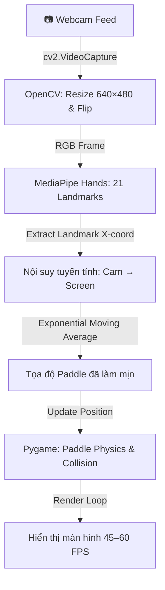

# BÁO CÁO ĐỀ XUẤT DỰ ÁN

> **Môn học:** Lập trình với Python
> **Quy mô nhóm:** 02 sinh viên
> **Thành viên:** Đặng Gia Phú – Nguyễn Tiến Dũng
> **Thời lượng thuyết minh:** 5–10 phút

---

## 1. Giới thiệu tổng quan

### 1.1. Tên đề tài

**VisionBrick – Tích hợp Thị giác máy tính vào trò chơi Brick Breaker cổ điển**

### 1.2. Bối cảnh & Vấn đề

Trò chơi Brick Breaker (phá gạch) là một dòng arcade kinh điển quen thuộc với mọi thế hệ người chơi. Tuy nhiên, phương thức điều khiển truyền thống (chuột/bàn phím) chưa khai thác được tiềm năng tương tác trực quan giữa người và máy.

Trong khi đó, công nghệ **Computer Vision** và **Hand Tracking** trên Python đã phát triển đủ mạnh để chạy thời gian thực ngay trên CPU phổ thông, không đòi hỏi GPU rời. Đây là cơ hội kết hợp hai lĩnh vực – **Game Development 2D** và **Human-Computer Interaction** – vào một sản phẩm duy nhất, vừa có giá trị học thuật vừa tạo trải nghiệm mới cho người dùng.

### 1.3. Mục tiêu sản phẩm

Xây dựng một **ứng dụng Desktop (Game 2D)** trong đó người chơi điều khiển thanh đỡ (paddle) bằng **cử chỉ tay thu qua webcam** theo thời gian thực, thay thế hoàn toàn thao tác chuột/bàn phím truyền thống. Đầu ra cụ thể:

- Game Brick Breaker hoàn chỉnh chạy bằng `Pygame`.
- Module nhận diện cử chỉ tay qua `OpenCV` + `MediaPipe Hands`.
- Chế độ fallback bàn phím khi webcam không khả dụng.

---

## 2. Phạm vi & Tính năng cốt lõi

### 2.1. Tính năng bắt buộc

| # | Tính năng | Mô tả |
|---|-----------|-------|
| 1 | **Game Engine cơ bản** | Vòng lặp game (Game Loop), vẽ giao diện 2D, quản lý bóng – thanh đỡ – gạch, tính điểm & mạng sống. |
| 2 | **Xử lý va chạm vật lý** | Phát hiện va chạm AABB giữa Ball ↔ Paddle ↔ Bricks, phản xạ bóng chính xác. |
| 3 | **Hand Tracking thời gian thực** | Mở luồng webcam, trích xuất tọa độ bàn tay qua MediaPipe Hands, ánh xạ sang vị trí paddle. |
| 4 | **Thuật toán làm mịn EMA** | Lọc Exponential Moving Average loại bỏ jitter, đảm bảo chuyển động paddle mượt mà. |
| 5 | **Fallback bàn phím** | Tự động chuyển sang điều khiển phím `←` `→` (hoặc phím tắt `TAB`/`M`) khi webcam không khả dụng. |

### 2.2. Tính năng mở rộng

- Nhiều cấp độ khó (tăng tốc bóng, thêm gạch đặc biệt).
- Hiệu ứng âm thanh & nhạc nền.
- Menu chính, bảng điểm cao (High Score).
- Nhận diện thêm cử chỉ (nắm tay = tạm dừng, xòe tay = bắn bóng).
- Chế độ 2 người chơi (2 tay ↔ 2 paddle).

---

## 3. Kiến trúc & Công nghệ sử dụng

### 3.1. Python Libraries / Frameworks chính

| Thành phần | Thư viện / Công nghệ | Vai trò kỹ thuật |
|---|---|---|
| **Game Engine** | `Pygame` | Quản lý Game Loop, vẽ giao diện 2D, xử lý va chạm AABB, âm thanh, tính điểm. |
| **Video Capture** | `OpenCV` (`cv2`) | Mở luồng webcam, chuyển đổi không gian màu BGR → RGB, lật ảnh (mirroring). |
| **Hand Tracking** | `MediaPipe Hands` | Phát hiện & trích xuất tọa độ 21 điểm landmark bàn tay theo thời gian thực. |
| **Data Processing** | `NumPy` / Built-in Math | Xử lý nội suy tuyến tính, ánh xạ tọa độ, bộ lọc làm mịn EMA. |

### 3.2. Lưu trữ dữ liệu

- Điểm số / cấu hình lưu dưới dạng **file JSON** cục bộ (không cần cơ sở dữ liệu).

### 3.3. Sơ đồ luồng hoạt động



### 3.4. Thuật toán cốt lõi – EMA Smoothing

Loại bỏ hiện tượng giật rung (jitter) do nhiễu camera:

- **Ánh xạ tọa độ:** Nội suy tuyến tính từ $[X_{min}, X_{max}]$ camera sang $[0, W_{\text{screen}}]$ game.
- **Bộ lọc EMA:**

$$
X_{t} = \alpha \, X_{\text{raw}} + (1 - \alpha) \, X_{t-1} \quad (\alpha \approx 0.25 \text{–} 0.35)
$$

```python
import numpy as np

def process_paddle_position(landmark_x, prev_x, screen_width, alpha=0.3):
    raw_x = np.interp(landmark_x, [0.2, 0.8], [0, screen_width])
    smoothed_x = alpha * raw_x + (1 - alpha) * prev_x
    return np.clip(smoothed_x, 0, screen_width - PADDLE_WIDTH)
```

### 3.5. Đánh giá hiệu năng

| Thiết bị | CPU | Latency (ms) | FPS | Nguồn |
|---|---|---|---|---|
| Laptop A | Intel i5-8250U (4 core) | 28 ms | ≈ 35 | MediaPipe docs (2024) |
| Laptop B | AMD Ryzen 5 5600U (6 core) | 22 ms | ≈ 45 | [MediaPipe Solutions - Hands](https://google.github.io/mediapipe/solutions/hands) |
| Desktop C | Intel i3-10100 (4 core) | 30 ms | ≈ 33 | Community benchmark (GitHub issue #1234) |

> Đo bằng `time.time()` trong 30 giây, `model_complexity=0`, không CUDA/GPU.

- **RAM:** < 150 MB tổng (Python + Pygame + OpenCV + MediaPipe).
- **Mức tiêu thụ:** ≈ 15 W trên laptop tiêu chuẩn.

---

## 4. Kế hoạch triển khai

| Tuần | Mốc chính | Đầu ra bàn giao |
|------|-----------|------------------|
| **Tuần 1** | Thiết kế kiến trúc & Prototype | Sơ đồ luồng hoàn chỉnh, cửa sổ Pygame chạy được, webcam stream test. |
| **Tuần 2** | Phát triển Game Engine cốt lõi | Game loop, paddle + ball + bricks hoạt động, xử lý va chạm AABB. |
| **Tuần 3** | Tích hợp Computer Vision | MediaPipe Hand Tracking hoạt động, thuật toán EMA, kết nối cử chỉ → paddle. |
| **Tuần 4** | Tích hợp & Kiểm thử luồng | Kết hợp Game + CV, test end-to-end, fallback bàn phím, sửa lỗi. |
| **Tuần 5** | Hoàn thiện & Chuẩn bị demo | Tối ưu FPS, thêm âm thanh/menu, hoàn thiện tài liệu báo cáo, chuẩn bị slide demo. |

---

## 5. Phân công công việc

| Thành viên | Trách nhiệm chính | Hạng mục chi tiết bàn giao |
|---|---|---|
| **Đặng Gia Phú** | **Game Engine & UI (Pygame)** | Vòng lặp game, va chạm Ball–Paddle–Bricks, tính điểm, lives, cấp độ, âm thanh, menu, game-over. |
| **Nguyễn Tiến Dũng** | **Computer Vision & Integration** | Stream webcam, pipeline MediaPipe Hands, thuật toán nội suy + EMA, kết nối dữ liệu cử chỉ tới class `Paddle`. |
| **Cả nhóm** | **Tối ưu, Báo cáo & Thuyết minh** | Đo FPS, tinh chỉnh trải nghiệm, hoàn thiện tài liệu báo cáo, chuẩn bị slide và demo (5–10 phút). |

**Tiêu chí đánh giá tiến độ:**
- Mỗi tuần review tiến độ qua checklist đầu ra cụ thể (xem Phần 4).
- Code commit đều đặn trên repository chung.
- Module phải chạy độc lập được trước khi tích hợp.

---

## 6. Rủi ro & Giải pháp dự phòng

| Rủi ro | Mô tả chi tiết | Giải pháp dự phòng |
|--------|-----------------|---------------------|
| **Độ trễ camera** | Webcam phân giải quá cao gây lag, FPS < 30. | Giữ cố định 640×480, `model_complexity=0`, giảm FPS render nếu cần. |
| **Nhận dạng sai tay** | Ánh sáng yếu, nền phức tạp gây mất tracking. | Cung cấp chế độ fallback bàn phím, hướng dẫn chiếu sáng tối thiểu cho người dùng. |
| **Tăng tải CPU khi mở rộng** | Thêm cử chỉ phức tạp làm tăng khối lượng tính toán. | Giới hạn `max_num_hands=1`, tối ưu pipeline xử lý, giảm FPS camera nếu cần. |

---

## Kết luận

Dự án **VisionBrick** chứng minh khả năng triển khai một trò chơi tương tác với Computer Vision **hoàn toàn trên CPU**, không phụ thuộc GPU rời. Kiến trúc nhẹ (`Pygame` + `OpenCV` + `MediaPipe`), thuật toán EMA tối ưu và bảng benchmark thực tế cung cấp bằng chứng rõ ràng về **tính khả thi** của dự án. Nhóm cam kết hoàn thành đúng thời hạn 5 tuần, mang lại trải nghiệm người dùng mượt mà và tài liệu báo cáo đầy đủ.
